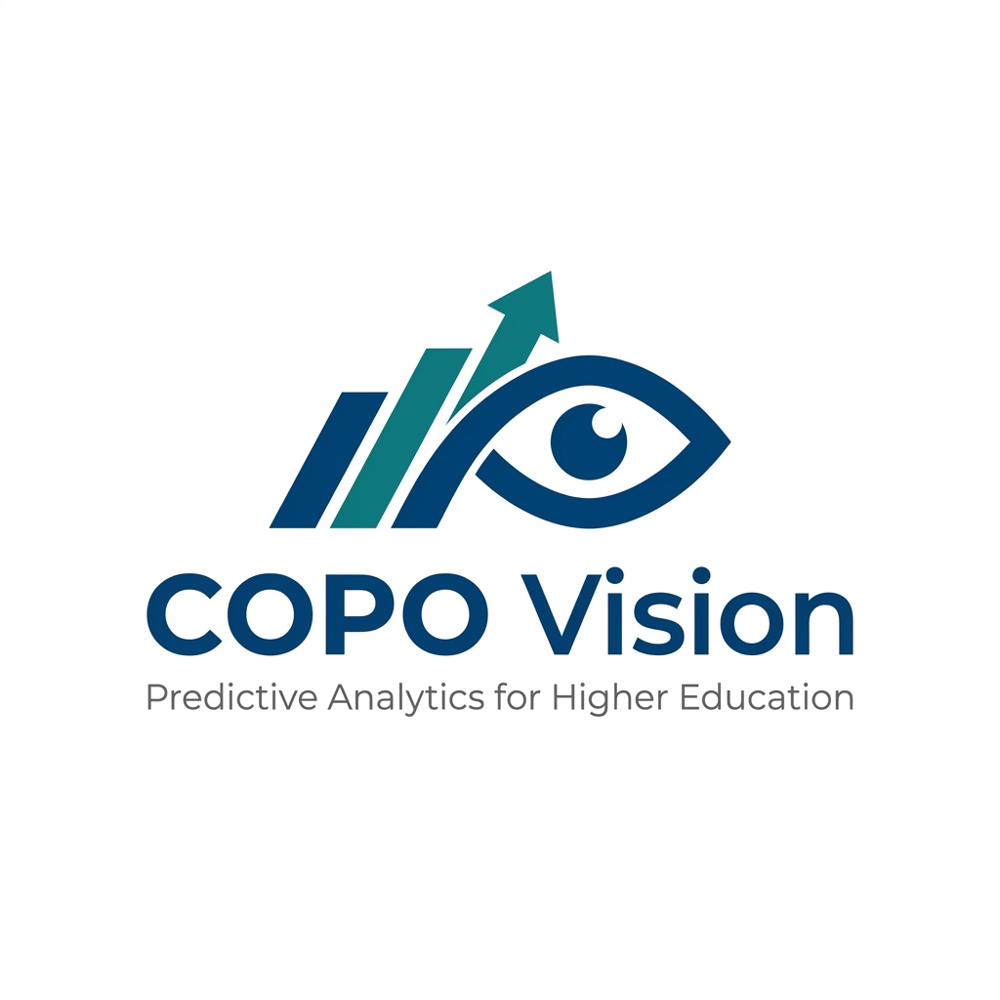
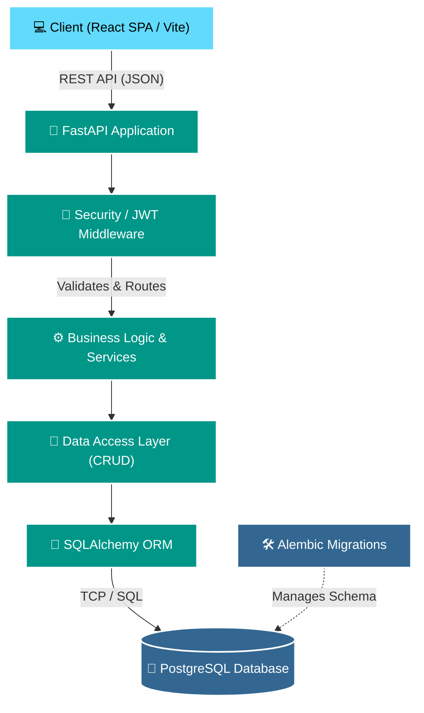
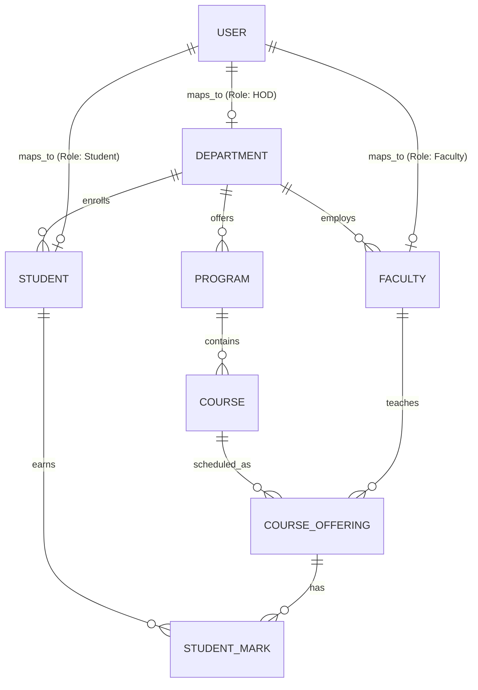

<div align="center">
  
  <h1>COPO Vision</h1>
  <p><strong>Predictive Analytics Platform for NBA Outcome Attainment</strong></p>
  
  <p>
    
    
    
    
    
  </p>
</div>

---

## 📖 Overview

**COPO Vision** is an enterprise-grade software platform designed to manage, track, and predict NBA (National Board of Accreditation) Outcome Attainments for higher education institutions. The system provides a centralized repository for academic master data and will ultimately leverage Machine Learning to predict student outcomes and generate comprehensive analytical reports.

This repository currently hosts the completion of **Phase 1**, which establishes the robust foundational architecture, secure authentication, and the core Master Data Management system.

---

## ✨ Key Features (Current Progress)

- **Enterprise Security & RBAC:** Secure JWT-based stateless authentication with strict Role-Based Access Control (RBAC) supporting `Admin`, `HOD`, `Faculty`, and `Student` hierarchies.
- **Master Data Management:** Full CRUD capabilities for Departments, Programs, Courses, Subjects, Academic Years, Semesters, Faculty, and Students.
- **Dynamic Dashboard Interface:** A highly responsive, Tailwind-powered React dashboard featuring interactive data tables, intelligent search, and pagination.
- **Scalable Database Architecture:** PostgreSQL backed by SQLAlchemy ORM with automated Alembic migrations for seamless schema evolution.
- **API First Design:** Fully documented RESTful endpoints powered by FastAPI and OpenAPI/Swagger.

*(Note: Advanced AI Predictions, CO/PO Calculation Engines, and Complex Analytics are slated for Phase 2).*

---

## 🏗️ System Architecture

COPO Vision follows a modern decoupled client-server architecture.



---

## 🗄️ Core Data Model (Phase 1)

Below is a high-level representation of the core entity relationships established in the database.



---

## 🛠️ Technology Stack

| Layer | Technologies |
| :--- | :--- |
| **Frontend** | React 18, Vite, TypeScript, Tailwind CSS, Lucide Icons, Axios, React Hook Form, Zod |
| **Backend** | Python 3.12+, FastAPI, Pydantic, Passlib (Bcrypt), PyJWT |
| **Database** | PostgreSQL, SQLAlchemy (ORM), Alembic (Migrations) |
| **Infrastructure** | GitHub Actions (Planned), Uvicorn |

---

## 📂 Repository Structure

```bash
COPO-Vision/
├── backend/                  # FastAPI Application
│   ├── alembic/              # Database migration scripts
│   ├── app/                  # Application Source Code
│   │   ├── api/              # API Routers (v1 endpoints)
│   │   ├── core/             # Core configurations & security
│   │   ├── crud/             # Database access utilities
│   │   ├── models/           # SQLAlchemy ORM Tables
│   │   └── schemas/          # Pydantic validation models
│   └── seed.py               # Database initialization script
│
├── frontend/                 # React UI Application
│   ├── src/                  # Frontend Source Code
│   │   ├── components/       # Reusable layout and UI components
│   │   ├── pages/            # View components (Login, Dashboards)
│   │   └── services/         # Axios API clients
│   └── tailwind.config.js    # Tailwind styling config
│
├── scripts/                  # Utility and code-generation scripts
└── .github/                  # Enterprise GitHub Templates (Issues/PRs)
```

---

## 🚀 Installation & Getting Started

### Prerequisites
- **Python 3.12+** ([python.org](https://www.python.org/))
- **Node.js 18+ & npm** ([nodejs.org](https://nodejs.org/))
- **PostgreSQL 14+** (Local service or Docker container)

---

### 1. Database Configuration

Ensure your PostgreSQL service is running and create the database (e.g. `copovision`).

Create a `.env` file in the `backend/` directory (`backend/.env`):
```ini
PROJECT_NAME="COPO Vision API"
API_V1_STR="/api/v1"
SECRET_KEY="your-secure-random-secret-key-min-32-chars"
ACCESS_TOKEN_EXPIRE_MINUTES=1440

POSTGRES_SERVER="localhost"
POSTGRES_PORT="5432"
POSTGRES_USER="postgres"
POSTGRES_PASSWORD="your_postgres_password"
POSTGRES_DB="copovision"
```

---

### 2. Backend Setup & Startup

#### A. Setup Environment & Install Dependencies

**On Windows (PowerShell):**
```powershell
cd backend

# 1. Create and activate virtual environment
python -m venv venv
.\venv\Scripts\Activate.ps1

# 2. Upgrade pip and install dependencies
pip install --upgrade pip
pip install -r requirements.txt
```

**On Windows (Command Prompt - CMD):**
```cmd
cd backend
python -m venv venv
venv\Scripts\activate.bat
pip install --upgrade pip
pip install -r requirements.txt
```

**On Linux / macOS (Bash / Zsh):**
```bash
cd backend
python3 -m venv venv
source venv/bin/activate
pip install --upgrade pip
pip install -r requirements.txt
```

#### B. Database Migrations & Data Seeding

With your virtual environment activated:
```bash
# 1. Apply Alembic migrations to build tables
alembic upgrade head

# 2. Seed default Super Admin user (admin@copovision.com / adminpassword)
python seed.py

# 3. (Optional) Seed demo data for courses, faculty, students, and attainment rules
python seed_demo.py
python add_users.py
```

#### C. Start the Backend API Server

```bash
# Start FastAPI with auto-reload
uvicorn app.main:app --reload --port 8000
```
*Or via python module:*
```bash
python -m uvicorn app.main:app --reload --host 127.0.0.1 --port 8000
```

- 🌐 **Base API URL:** `http://localhost:8000`
- 📑 **Swagger Interactive Docs:** `http://localhost:8000/docs`
- 📖 **ReDoc Documentation:** `http://localhost:8000/redoc`

#### D. Run Backend Test Suite

```bash
# Run all tests
python -m pytest -v -W ignore

# Run security & authentication regression tests
python -m pytest tests/test_auth_status.py -v -W ignore
```

---

### 3. Frontend Setup & Startup

Open a new terminal window:

```bash
cd frontend

# 1. Install npm dependencies
npm install

# 2. Start the Vite development server
npm run dev
```

- 🖥️ **Frontend Application URL:** `http://localhost:5173`
- 🔨 **Production Build:** `npm run build`
- 👁️ **Preview Build:** `npm run preview`

---

### 4. Default Seed Credentials

After running `python seed.py` and `python add_users.py`:

| Role | Email | Default Password | Access Level |
| :--- | :--- | :--- | :--- |
| **Super Admin** | `admin@copovision.com` | `adminpassword` | Full system administration & user management |
| **Admin** | `admin@example.com` | `password123` | Department & master data administration |
| **Faculty** | *(generated in seed)* | `password123` | Course management, assessments & marks entry |
| **Student** | *(generated in seed)* | `password123` | Attainment & scorecard view |

---

## 🤝 Contributing

We welcome contributions to COPO Vision! Please review our [Contributing Guidelines](CONTRIBUTING.md) and [Code of Conduct](CODE_OF_CONDUCT.md) before submitting pull requests. 

If you find a bug or have a feature request, please use the templates provided in the Issues tab. For security vulnerabilities, refer to our [Security Policy](SECURITY.md).

---

## 📄 License

This project is licensed under the MIT License - see the [LICENSE](LICENSE) file for details.
